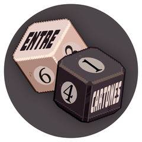

<p align="center">  </p>

# Entre Cartones

Analytics file
```
ga-config.js
```

Merch file, contains both the og mockup, link, name and price
```json
static/merch.json

[{
    "image": "path",
    "name": "name",
    "price": "price",
    "url": "url"
}]
```